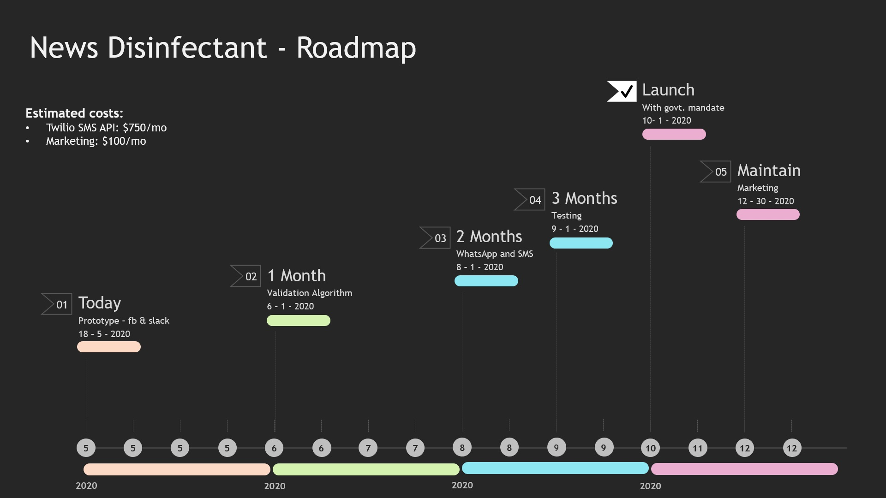

[](https://www.apache.org/licenses/LICENSE-2.0) [](https://callforcode.org/slack) [](https://srichakradhar.github.io/Antivirals-CFC2020/)

# Antivirals-CFC2020: News Disinfectant Chatbot
Antivirals Call for Code 2020 - Fight Fake News

Fake news can have dangerous consequesnces, if left unchecked and can be made believed by large groups of people. There are a few anti-social elements which encourage this idea. Our aim is to fight the news with a highly available IBM Watson chatbot service.

## Contents

1. [Short description](#short-description)
1. [Demo video](#demo-video)
1. [The architecture](#the-disinfectant-architecture)
1. [Long description](#long-description)
1. [Project roadmap](#project-roadmap)
1. [Getting started](#getting-started)
1. [Running the tests](#running-the-tests)
1. [Live demo](#live-demo)
1. [Built with](#built-with)
1. [Contributing](#contributing)
1. [Versioning](#versioning)
1. [Authors](#authors)
1. [License](#license)
1. [Acknowledgments](#acknowledgments)

## Short description

### What's the problem?

Communicating the correct news is the key during a pandemic situation. Even though there a are a few aspects to identify fake news from the genuine, a lot of people lack the knowledge to distinguish fake news from the real news. So they believe in the fake news and it gets spread very fast with the current communication technology.

### How can technology help?

A chatbot with the knowledge of distinguishing fake news from the real news can be of great help if added as a sanity check before sharing a uncertain message/news.

### The idea

Help the people to identify fake news with a chatbot trained on automated validaiton criteria.

## Demo video

[](https://youtu.be/vOgCOoy_Bx0)

## The "Disinfectant" architecture


1. The user forwards or speaks a news/message to the **News Disinfectant** bot.
2. Watson **Speech to Text** processes the audio and extracts the text (only when voice is used).
3. NodeRed sends the text to **IBM Watson Assistant**.
4. IBM Watson Assistant receives text from either forwarded message or NodeRed and sends the text to **IBM functions** action when it cannot match any existing intent.
5. The action calls different external APIs Covid19 API, Twitter search API, Fake News Detector API and **IBM Discovery** to gather more information, runs the **validation algorithm** and sends the response back to IBM Watson.
6. IBM Watson Assistant shows the findings about the news to the user.

## Long description

[More detail is available here](DESCRIPTION.md)

## Project roadmap



## Getting started

These instructions will get you a copy of the project up and running on your local machine for development and testing purposes. See deployment for notes on how to deploy the project on a live system.

### Prerequisites

Install NodeJS and NPM and NodeRed.

```bash
sudo apt-get install nodejs
sudo npm install -g --unsafe-perm node-red
```

For detailed installation instrucitons, check:
* NodeJS and NPM: https://linuxize.com/post/how-to-install-node-js-on-ubuntu-18.04/
* NodeRed: https://nodered.org/docs/getting-started/local

### Installing

Install node modules and run NodeRed server

```bash
npm install
npm start
Server running at http://127.0.0.1:8000/
```

## Running the tests

Explain how to run the automated tests for this system

### Break down into end to end tests

Explain what these tests test and why, if you were using something like `mocha` for instnance

```bash
npm install mocha --save-dev
vi test/test.js
./node_modules/mocha/bin/mocha
```

### And coding style tests

Explain what these tests test and why, if you chose `eslint` for example

```bash
npm install eslint --save-dev
npx eslint --init
npx eslint sample-file.js
```

## Live demo

You can find a running system to test at [callforcode.mybluemix.net](http://callforcode.mybluemix.net/)

## Built with

* [IBM Watson Assistant](https://cloud.ibm.com/catalog?search=IBM%20Watson%20Assistant#search_results) - The Chatbot service from IBM
* [IBM Speech to Text](https://cloud.ibm.com/catalog?search=Speech%20to%20Text#search_results) - To enable speech input.
* [IBM Text to Speech](https://cloud.ibm.com/catalog?search=Text%20to%20Speech#search_results) - To enable voice interface.
* [IBM Cloud Functions](https://cloud.ibm.com/catalog?search=cloud%20functions#search_results) - The compute platform for handing logic
* [IBM Discovery](https://cloud.ibm.com/catalog?search=Discovery#search_results) - Powerful analytics engine used to collect cognitive enrichments and insights from news.
* [Apache Open Whisk](https://developer.ibm.com/technologies/microservices/projects/openwhisk) - A polyglot functions-as-a-service (FaaS) programming platform 
* [Node Red](https://nodered.org/) - The flow based low code programming editor for connecting cloud services.
* [Twitter](https://twitter.com/) - Social media platform to collect news and posts
* [Fake News Detector](https://fakenewsdetector.org/en) API - to identify common fake news.
## Contributing

Please read [CONTRIBUTING.md](CONTRIBUTING.md) for details on our code of conduct, and the process for submitting pull requests to us.

## Versioning

We use [SemVer](http://semver.org/) for versioning. For the versions available, see the [tags on this repository](https://github.com/srichakradhar/Antivirals-CFC2020/tags).

## Authors

* **Srichakradhar Reddy Nagireddy** - *Initial work* - [Srichakradhar](https://github.com/srichakradhar)
* **Vamsipriya Chava** - *Initial work* - [Vamsipriya](https://github.com/srichakradhar)

See also the list of [contributors](https://github.com/srichakradhar/Antivirals-CFC2020/graphs/contributors) who participated in this project.

## License

This project is licensed under the Apache 2 License - see the [LICENSE](LICENSE) file for details

## Acknowledgments

* Based on [Billie Thompson's README template](https://gist.github.com/PurpleBooth/109311bb0361f32d87a2).
* Guided by [Create a voice-enabled COVID-19 chatbot using Node-RED](https://developer.ibm.com/tutorials/create-a-voice-enabled-covid-19-chatbot-using-node-red/)
